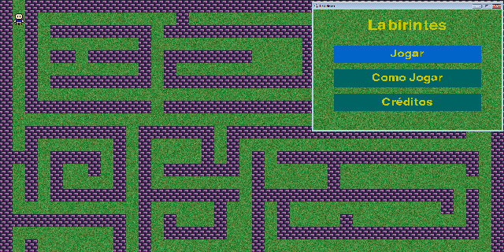
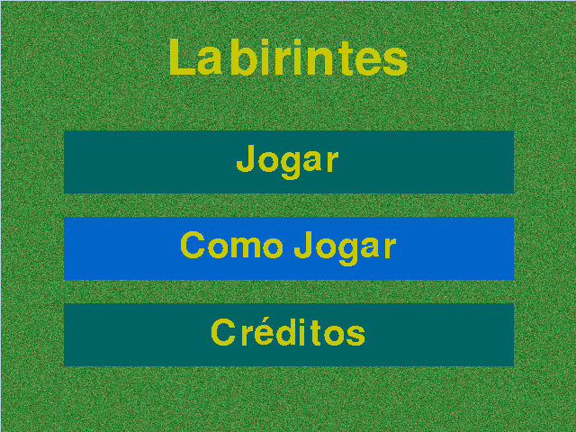

# Labirintes
  
Um jogo de labirinto feito com pixel arte e com Python-Pygame. 
   
## Como Jogar?
O jogo é bem simples e faz uso apenas das setas do teclado e do mouse para funcionar.  
Para mais informações pode usar a abra "Como jogar" do jogo que se localiza no menu inicial.
  

## Créditos
Eduardo de Moura

### Imagens do jogo
* "27 Bricks" by SpiderDave licensed CCO: https://opengameart.org/content/27-bricks  

* "640x480 Ground Textures" hornpipe2 licensed CCO:https://opengameart.org/content/640x480-ground-textures  

* "Base character spritesheet 16x16" by Cough-E licensed CCO: https://opengameart.org/content/base-character-spritesheet-16x16   
  
* "Pixel Coins Asset" by truezipp licensed CCO: https://opengameart.org/content/pixel-coins-asset

### Sons do jogo
* "The Adventure Begins" by Bart licensed CC-BY 3.0: https://opengameart.org/content/adventure-begins    
* "Walking on snow sound" by IgnasD licensed CC0:https://opengameart.org/content/walking-on-snow-sound

